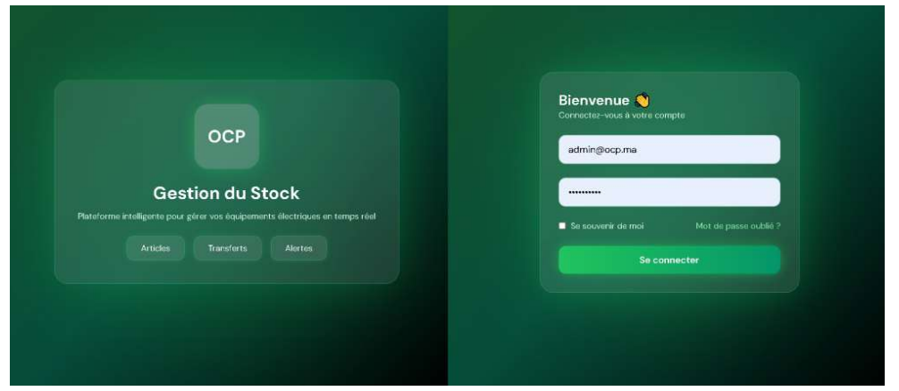
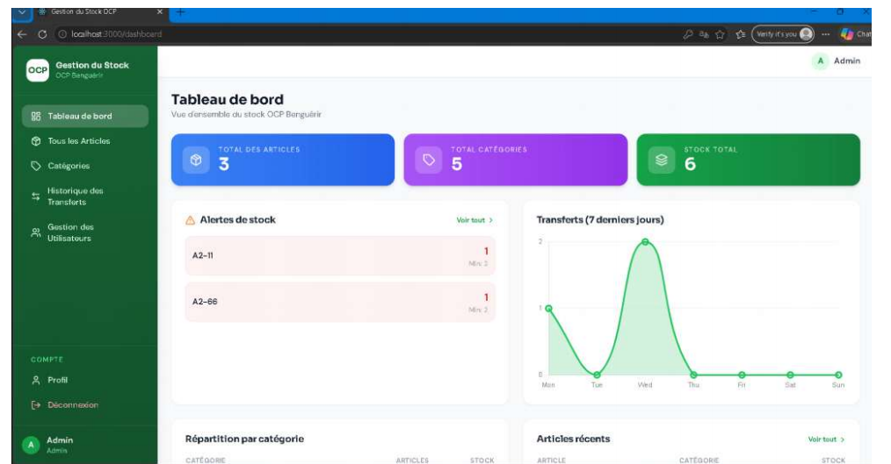

# 🏭 OCP Stock Management — Frontend

A modern React application developed for managing electrical stock at OCP Benguerir. The application provides a complete interface to manage articles, categories, transfers, users, and inventory statistics.

---

## ✨ Features

- 🔐 Secure Authentication
- 📊 Interactive Dashboard
- 📦 Articles Management (CRUD)
- 🗂️ Categories Management
- 🔄 Stock Transfers
- 👥 User Management
- 📱 Responsive Design
- 📄 QR Code & Barcode Generation
- 🖨️ Printing Support
- 📈 Charts & Statistics

---

## 📸 Screenshots

### Authentication



### Dashboard



### Articles Management


---

## 🛠️ Technologies Used

- React.js
- React Router
- Axios
- Tailwind CSS
- Chart.js
- QRCode.js
- JsBarcode
- React Hot Toast

---

## 📁 Project Structure

```text
src/
├── components/
├── context/
├── pages/
├── services/
└── App.jsx
```

---

## 🚀 Installation

Clone the repository

```bash
git clone https://github.com/far34W/ocp-stock-frontend.git
```

Go to the project

```bash
cd ocp-stock-frontend
```

Install dependencies

```bash
npm install
```

Start the development server

```bash
npm start
```

---

## 🔗 Backend

The frontend communicates with the Laravel REST API:

👉 https://github.com/far34W/ocp-stock-backend

---

## 👨‍💻 Author

**Zakaria Fartat**

Full Stack Developer (Laravel • React • Flutter)
